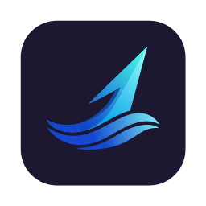

  

# JetWhale

JetWhale is a next-generation, extensible debugging tool inspired
by [Flipper](https://github.com/facebook/flipper).

It is built with Kotlin and Jetpack Compose, making it especially familiar and approachable for
Kotlin / Android developers.
Thanks to its Kotlin-first design, JetWhale can be introduced with a minimal learning curve.

> [!NOTE]
> This project is under active development.
> We welcome feedback as we work toward a stable release.
> Please note that the Plugin SDK APIs are not yet finalized and may change in the future.

📖 **Documentation: <https://kitakkun.github.io/JetWhale/>**

## Features

- 🐳 **Powerful Debugging Platform**
    - Provides a modern and rich debugging experience powered by **Kotlin** and **Jetpack Compose**
    - Supports debugging **multiple sessions simultaneously**
    - Debugging tools are implemented as **plugins**, which can be dynamically loaded at runtime as
      JAR files

- ⚙️ **Easy Integration and Customization**
    - DSL-based APIs allow you to quickly set up and configure JetWhale in your application
    - Customize the debugging experience by creating your own plugins using familiar **Kotlin**
      and **Jetpack Compose** paradigms

- 🛜 **Type-safe Communication with kotlinx.serialization**
    - Leverages **kotlinx.serialization** to enable type-safe communication between the debugger
      and debuggees

- ✅ **Multiplatform Support**
    - Supports **Android**, **Desktop(JVM)**, **iOS**(Simulator Only), and **Web** (Js, WasmJs)
      debuggees

- 🤖 **MCP Server Support** *(Experimental)*
    - JetWhale exposes a built-in **MCP (Model Context Protocol) HTTP+SSE server**, allowing AI
      agents (e.g. Claude) to interact with debuggee apps directly
    - Built-in tools include `screenshot`, `click`, `type`, `scroll`, `drag`, and
      `getAccessibilityTree`
    - Plugins can expose their own custom MCP tools by implementing `JetWhaleMcpCapablePlugin`

- 🔥 **Hot-Reloadable Plugin Development**
    - Build your own plugins in your **own** repository against the published SDK — no fork needed
    - `runJetWhale` downloads a real JetWhale host and launches it with your plugin loaded;
      edit your plugin, re-stage, and the host **hot-reloads** it — no restart
    - See [Developing plugins](https://kitakkun.github.io/JetWhale/guide/developing-plugins)

## Developing plugins

JetWhale's debugging tools are plugins, and you can build your own in your **own** repository with a
fast, **hot-reload** dev loop:

- Apply the published `com.kitakkun.jetwhale.host` Gradle plugin and compile against the published SDK.
- Run a real host with `./gradlew :myPlugin:runJetWhale` (it downloads the host for your
  OS — no manual install).
- Re-stage on save with `./gradlew :myPlugin:stageDevPlugin -t`; the host reloads your plugin without
  a restart — keeping its state for simple (method-body) edits, and recreating it for structural
  changes (see the [limitations](https://kitakkun.github.io/JetWhale/guide/developing-plugins#limitations)).

See **[Developing plugins](https://kitakkun.github.io/JetWhale/guide/developing-plugins)** for the full guide.
