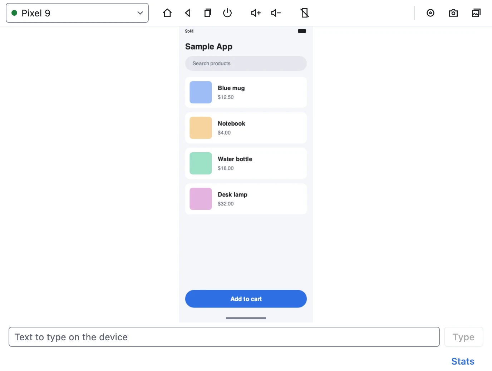
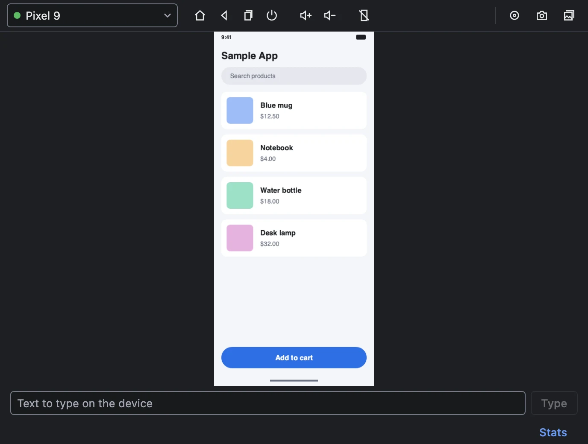
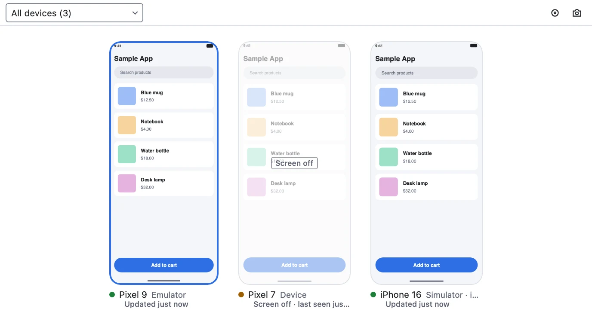
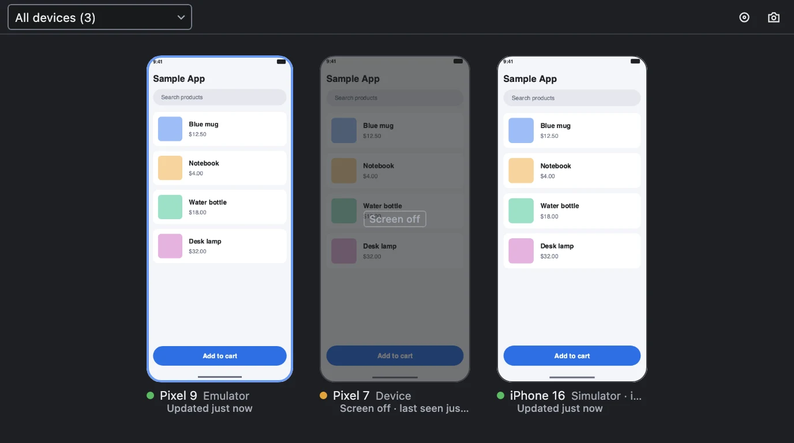
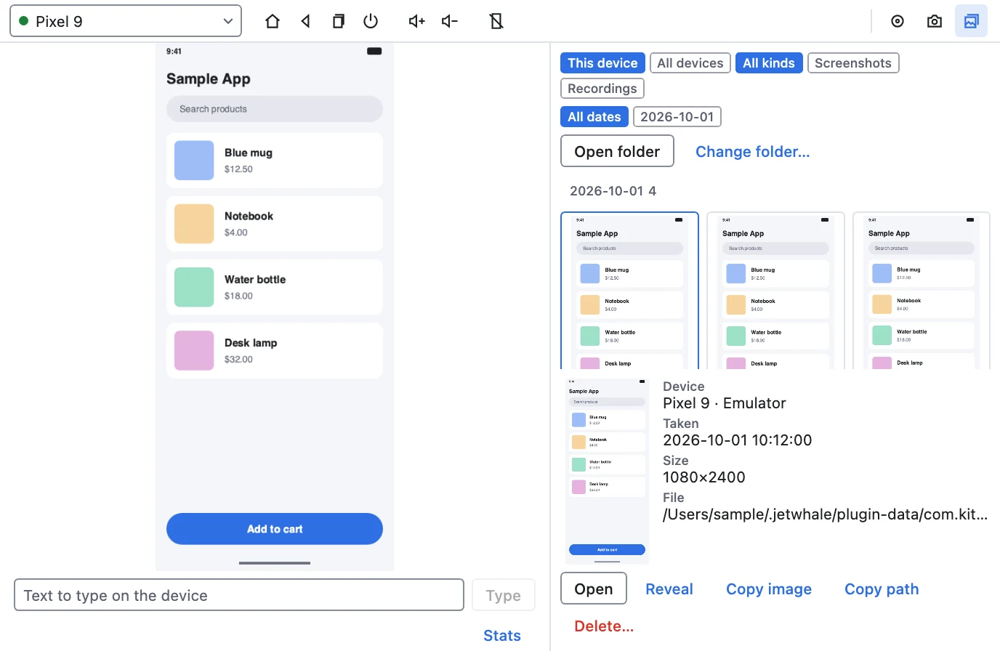
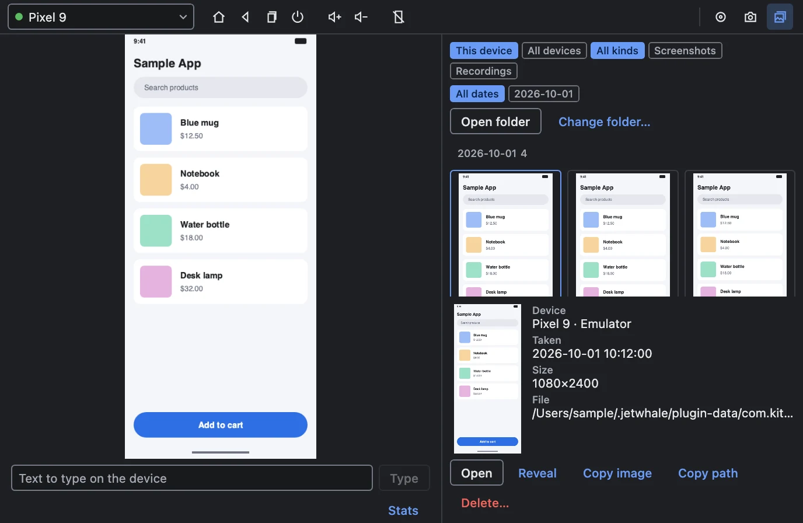

# Device Mirror <Badge type="warning" text="experimental" />

The Device Mirror shows the live screen of an Android emulator or device, an iOS simulator, or a
physical iPhone inside the host window. On Android devices and iOS simulators you can tap, swipe,
type and press hardware buttons on the mirrored screen; a physical iPhone takes input too once you
set your development team, which is experimental. Every device can take screenshots and recordings,
kept per device so the ones from a test run are easy to find again. An AI agent can do the same over
MCP.

It needs no app: nothing is added to the app you debug, and it is listed at the top of the sidebar,
above the app picker, usable as soon as the host starts with nothing connected — see
[Plugins that need no app](/guide/host-window#plugins-that-need-no-app).

{.light-only width=688}
{.dark-only width=688}

## Setup

### Install the host plugin

Install **Device Mirror** from **Settings → Plugins → Add Plugins → Official Plugins**. To install it
by Maven coordinates instead, use `com.kitakkun.jetwhale:jetwhale-device-mirror:<version>`, released
with the host under the host's version.

### Tools on your machine

The plugin drives the command-line tools you already use for devices, and looks for them where a
terminal would find them (see [How the tools are found](#how-the-tools-are-found)). When a tool is
missing, the device list says which one and what it would enable.

| To mirror | You need |
|-----------|----------|
| Android emulators and devices | `adb` from the Android SDK platform-tools |
| iOS simulators (macOS) | Xcode, for `simctl` and for input; [idb](https://fbidb.io) for live video: `brew install facebook/fb/idb`, which installs the command-line client and its companion |
| iPhones connected by USB (macOS) | idb as above; for input, also Xcode, `iproxy` (`brew install libimobiledevice`) and a development team — see [Input on iOS](#input-on-ios) |
| Live video from Android devices and iPhones | [ffmpeg](https://ffmpeg.org): `brew install ffmpeg`, `winget install ffmpeg` or `apt install ffmpeg` |

Android devices and iPhones send their screen as H.264, which the plugin decodes with the `ffmpeg`
command. Without it an Android device is shown through screenshots a few times a second, and an
iPhone cannot be mirrored. iOS simulators, and Android emulators that expose their own gRPC screen
stream, need no ffmpeg; an emulator without that stream is decoded like a device, and so is a
foldable emulator folded through `adb shell cmd device_state state`.

### How the tools are found

An app started from Finder, the Dock or a desktop entry does not inherit your shell's `PATH`. So on
macOS and Linux the host reads the `PATH` your login shell sets up and searches it first, then the
host's own `PATH`, and then, as a fallback, Homebrew's `/opt/homebrew/bin` and `/usr/local/bin`. adb
is looked for in the Android SDK before all of these: `ANDROID_HOME`, `ANDROID_SDK_ROOT`, then the
SDK's default location. On Windows an app gets your `PATH` however it is started, so the plugin uses
it as it is.

To read that `PATH`, the plugin runs your shell (`$SHELL`, or `/bin/zsh` on macOS and `/bin/sh`
elsewhere when it is unset) as an interactive login shell, as a terminal does. It does so once per
run of the host, the first time it looks for devices; the host does the same once for
[its own adb](/guide/adb-auto-port-mapping#how-adb-is-found). The shell runs your startup files,
`.zshrc` and `.bashrc` included, so whatever they start runs again. When the shell has not answered
within 5 seconds, exits with an error or prints no `PATH`, the plugin searches only the host's
`PATH` and Homebrew's directories.

The tools the plugin starts get the directories it searched as their `PATH`, so a tool that looks
for others on `PATH` finds them too: a pyenv or asdf shim finds the program it stands for, and idb
finds `idb_companion`.

If a tool is reported missing although it is installed, open a new terminal and check that
`command -v <tool>` prints its path. If it prints nothing, add the tool's directory to `PATH` in your
shell's startup files. If it prints a path, check that your startup files finish within 5 seconds
without asking for input. Then restart the host, which reads the `PATH` again.

## Using it

### Devices and the grid

The device's name at the top left opens the device picker: every device, Android and iOS in two
groups, with its kind, its OS version (iOS only) and a dot for what the mirror last saw — showing its
screen, screen off, unavailable, or (hollow) not watched yet. A device appears once it is booted or
connected.

The picker's first entry, **All devices**, opens the grid: every device as a tile, at its own shape,
with a screenshot refreshed every 1.5 seconds and how long ago it was taken. Only tiles on screen are
captured, two at a time at most, and nothing streams meanwhile. Click a tile, or press Enter on it,
to open that device; hovering one offers **Open** and **Screenshot**.

{.light-only width=688}
{.dark-only width=688}

The grid's toolbar acts on every device at once. The camera button saves one screenshot per device.
The record button starts recording every device that can record; while any device records it turns
into **Stop all**, with a count of the devices recording. Until you tick **Don't show again**, it
asks before starting, because recording several devices at once is heavy on this machine — iOS
simulators most, since they encode their video on the Mac.

### Live view and input

The mirrored screen fills the pane at its own aspect ratio. A click is a tap and a drag is a swipe, at
the matching point on the device, and the field under the screen types into whatever has focus. When
an Android device rotates or a foldable folds, the view follows within a couple of seconds. Switching
back to a device shows its last frame at once, dimmed, until its stream reconnects.

When no live video is available, the mirror falls back to screenshots and says why above the text
field; it tries the video again after 5 seconds, then 15, then once a minute.

The toolbar's buttons are grouped — navigation, volume, screen power, captures — and wrap as a whole
in a narrow window. Android has Home, Back, Recent apps, Power, Volume up and Volume down; a simulator
has Home and Power, plus Recent apps when idb can send input; an iPhone that takes input has Home,
Power, Volume up and Volume down. On Android, **Screen off** and **Wake** turn the screen off and on,
and Wake lifts a lock screen that has no PIN, pattern or password. **Stats** under the screen shows
frames received and shown per second, the longest gap between frames, and how long decoding, copying
and drawing take.

### Input on iOS

Taps, swipes, text and buttons reach an iOS simulator or iPhone through an **XCTest runner**: a small
UI-test bundle that Xcode builds on this Mac, installs on the device and keeps running while it sends
the input. It is the way WebDriverAgent drives iOS, and it reaches the whole screen, the home screen
and system alerts included.

- **The first use builds it**, which takes ten to twenty seconds once per Xcode version; after that
  a runner starts in about three seconds. The mirror starts it as soon as it shows the device, so the
  first tap seldom waits.
- **One runner per device**, shared with any other plugin that drives iOS. It stops by itself after
  five minutes without input, and when the host quits. Its build and state live under the host's app
  data, in `xctest-runner/`.
- **On a simulator**, when the runner cannot be built or started, input goes through idb instead, as
  it did before. idb's input no longer works with Xcode 27, though, so there the runner is the only
  way. Recent apps still goes through idb, and the button is left out when idb cannot send input.

#### Input on a physical iPhone <Badge type="warning" text="experimental" />

Driving a physical iPhone follows Apple's and Appium's documentation for running an XCTest runner on
a device, and has not been tried on one yet. It needs:

1. **Your development team**, which signs the runner. Choose **Set team…** in the banner under the
   iPhone's screen and enter the ten-character team ID shown under Membership in your Apple
   Developer account. Xcode must be signed in to that team (**Xcode → Settings → Accounts**); a free
   personal team works.
2. **`iproxy`**, which forwards the runner's port over USB: `brew install libimobiledevice`.
3. **On the iPhone**: trust this Mac, turn on **Developer Mode** (Settings → Privacy & Security →
   Developer Mode, then restart), turn on **Enable UI Automation** (Settings → Developer), and keep it
   unlocked while it is driven. Signing also needs the iPhone online.

The banner under an iPhone says what is missing. A failure that only shows when the runner starts —
signing, Developer Mode, UI Automation, a locked iPhone — comes back as a notice when you first tap.

### Captures

**Screenshot** and **Record** in the toolbar save into the device's captures; while a recording runs,
Record turns into a red counter, and clicking it stops the recording. Each device records on its
own, so several can record at once. The notice that names a saved file offers **Open**, which shows
it in the Captures panel, and **Copy**.

Every capture is kept in a folder for its device, with one folder per day:

```text
captures/
  Pixel-9-3fa2c1d0/
    2026-09-25/
      123005-screenshot.png
      123005-screenshot.png.json
      123412-recording.mp4
      123412-recording.mp4.json
  iPhone-17-9b04e7aa/
    …
```

The short code after the device name comes from its serial number or UDID, so a device keeps its
folder across sessions and two devices with the same name get separate folders. The `.json` beside
each capture records the device's id, name, platform, kind and iOS version, the capture's size in
pixels, when it was taken, and a recording's length. The list is rebuilt from these files, so
captures from earlier sessions stay listed, and one deleted in Finder drops off.

The folder defaults to `~/.jetwhale/plugin-data/com.kitakkun.jetwhale.mirror/captures`; **Change
folder…** in the Captures panel picks another, and the host remembers it.

**Captures** in the toolbar opens the panel beside the live view:

- **This device / All devices** and **All kinds / Screenshot / Recording** filter the list, and the
  date tags narrow it to one day. Captures are grouped by day, newest first.
- Selecting a capture shows its details. **Open** opens it in its default app, **Reveal** shows it in
  Finder or Explorer, and **Delete…** removes it after you confirm. **Copy image** puts a screenshot
  on the clipboard as an image and as its file; **Copy file** puts a recording there as its file,
  which Finder, chat apps and upload fields accept. **Copy path** copies its absolute path.
- **Open folder** opens the device's folder, or the captures folder when all devices are shown.

{.light-only width=688}
{.dark-only width=688}

## MCP tools

With the [MCP server](/guide/mcp-server) running, an AI agent can do the same through these tools.
They live in the `host` session, which `jetwhale.listSessions` always lists first, so pass `host` as
their `sessionId`. The `deviceId` can be left out to use the device selected in the mirror.

| Tool | What it does |
|------|--------------|
| `com.kitakkun.jetwhale.mirror.listDevices` | The devices, with their ids, platform, kind, and what they accept: input, buttons, recording. A device that takes no input says why in `inputUnavailableReason`. An iOS device or simulator also reports `osVersion`; an Android device reports `screenOn` and `locked` |
| `com.kitakkun.jetwhale.mirror.captureScreenshot` | Saves a screenshot among the device's captures; returns its path and size in pixels |
| `com.kitakkun.jetwhale.mirror.tap` | Taps at a point, in the pixels of a screenshot |
| `com.kitakkun.jetwhale.mirror.swipe` | Swipes between two points over a duration |
| `com.kitakkun.jetwhale.mirror.pressButton` | Presses a hardware button the device has |
| `com.kitakkun.jetwhale.mirror.inputText` | Types text into the focused field |
| `com.kitakkun.jetwhale.mirror.setScreen` | Turns an Android device's screen on (`on: true`, also lifting a lock screen without a credential) or off; returns `screenOn` and `locked` afterwards, where `locked: true` means the device still needs unlocking |
| `com.kitakkun.jetwhale.mirror.startRecording` | Starts recording one device's screen, several devices' (`deviceIds`), or every device that can record (`all: true`) |
| `com.kitakkun.jetwhale.mirror.stopRecording` | Stops one recording, several (`deviceIds`), or all of them (`all: true`); returns each video's path and length |
| `com.kitakkun.jetwhale.mirror.listCaptures` | Saved captures, newest first, optionally only one `deviceId`, one `kind` (`Screenshot` or `Recording`), or those taken at or after `since` (epoch milliseconds) |

An agent can read a returned path to look at the capture.

## Limits

- **Input on a physical iPhone is experimental** and needs a development team, `iproxy` and the
  iPhone settings in [Input on a physical iPhone](#input-on-a-physical-iphone). Without them it is
  view-only, and MCP refuses input with the reason. Screenshots and recordings, taken from its video
  stream, work either way, and need ffmpeg.
- **If an iPhone stays black**, unlock it and keep its screen on; allow **Camera** access for the app
  that runs JetWhale (the host, or the terminal or IDE that launched it) in **System Settings →
  Privacy & Security → Camera**, since macOS delivers a USB device's screen as a camera; and check
  that it is connected by USB and trusts this Mac. The mirror lists the same hints.
- **A simulator's volume buttons** are shown disabled: XCTest cannot press them on a simulator.
- **Android stops a recording on its own after 180 seconds.**
- **On Android, text with a line break is refused**; type each line separately.
