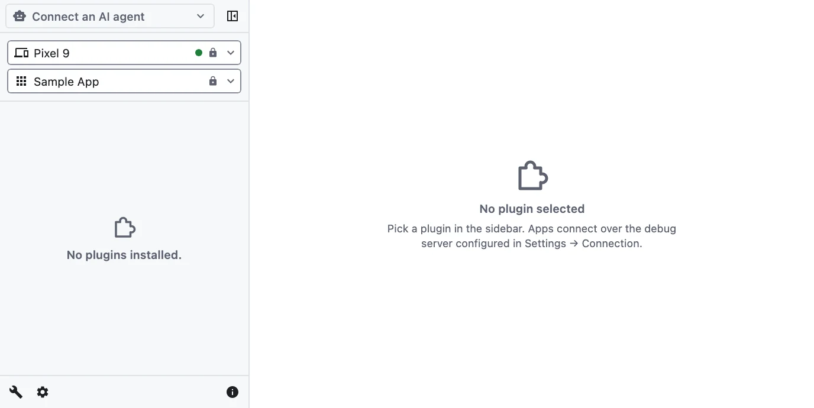
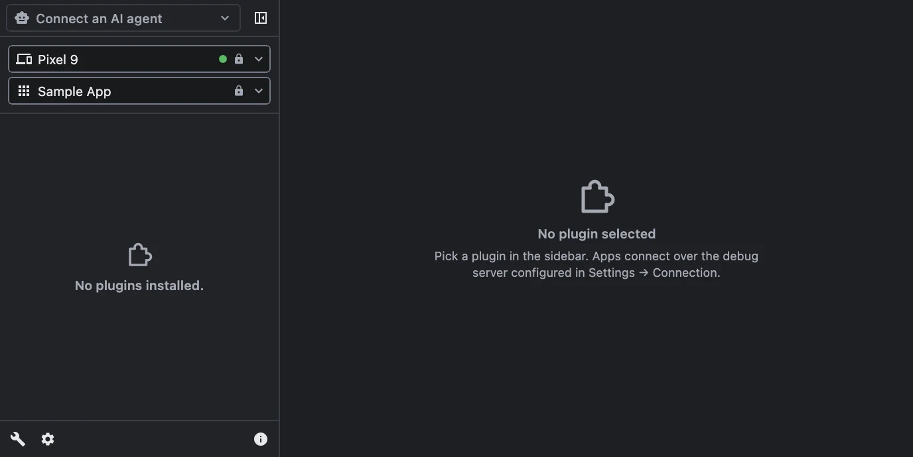
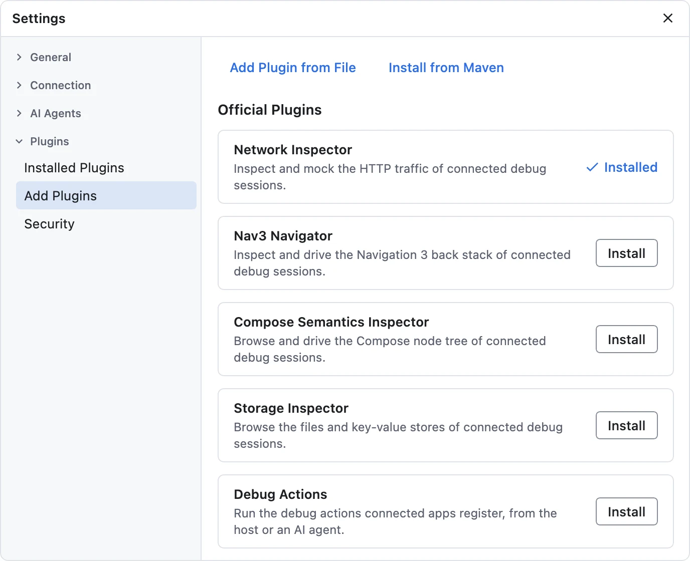
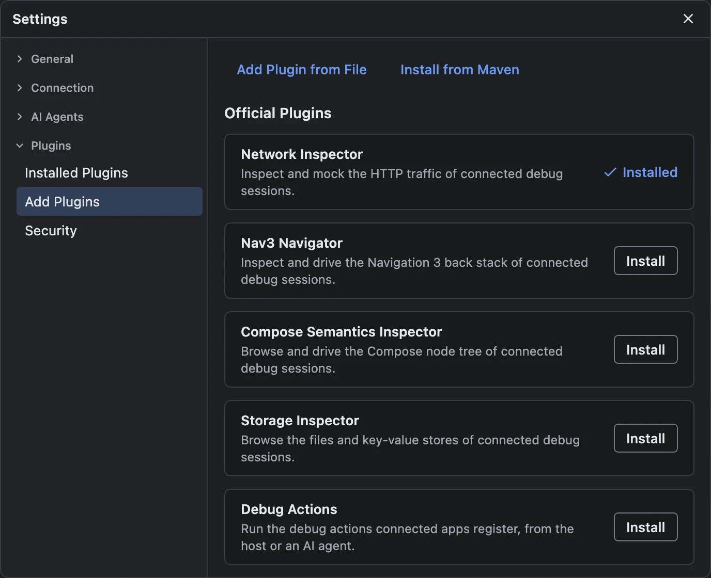

# Getting Started

Debugging with JetWhale takes two pieces: **the host**, the desktop debugger you run on your machine,
and **the agent runtime**, a small library in the app you want to debug. These steps install both,
connect your app, and add a first plugin.

## 1. Install the host

Download the installer for your OS from the
[GitHub releases page](https://github.com/kitakkun/JetWhale/releases):

| OS | Artifact |
|----|----------|
| macOS (Apple Silicon) | `jetwhale-debugger-<version>-macos-arm64.dmg` |
| Linux (x64) | `jetwhale-debugger-<version>-linux-x64.deb` |
| Windows (x64) | `jetwhale-debugger-<version>-windows-x64.msi` |

A runnable uber jar (`jetwhale-host-<version>-<osArch>.jar`) is also attached to each release if you
prefer `java -jar`.

::: details Linux notes
- Install the package with `sudo apt install ./jetwhale-debugger-<version>-linux-x64.deb`, which also
  pulls in anything it depends on. The host then appears in your desktop's application menu.
- The host draws at a whole-number scale (1×, 2×) and takes it from the `GDK_SCALE` environment
  variable (or `J2D_UISCALE`, which wins when both are set), not from the desktop's display
  settings. On a high-resolution screen, start it with `GDK_SCALE=2`; for the menu entry, copy
  `/opt/jetwhale-debugger/lib/jetwhale-debugger-JetWhale_Debugger.desktop` to
  `~/.local/share/applications/` and prefix its `Exec=` line with `env GDK_SCALE=2`. Fractional
  scaling is not available: a 150% desktop setting has no effect on the host, and a fractional value
  in either variable is rounded down (`1.5` gives 1×).
- The Japanese UI needs a CJK font, such as `fonts-noto-cjk` on Debian and Ubuntu; without one,
  Japanese text shows as empty boxes.
- On a Wayland session the host runs through XWayland.
:::

Launch the host. By default it listens for apps on **port 5080**.

### First launch

JetWhale is not notarized by Apple, and its Windows installer is not code-signed, so macOS and
Windows each ask you to confirm once. Linux has no such step.

- **macOS** — open the `.dmg` and drag **JetWhale Debugger** into **Applications**. The first time
  you open it, macOS blocks it. Close that dialog, open **System Settings → Privacy & Security**,
  click **Open Anyway** next to the message about JetWhale Debugger, and confirm. On macOS 15 and
  later, Control-click → **Open** no longer gets past the block.
- **Windows** — Microsoft Defender SmartScreen may stop the installer with *Windows protected your
  PC*. Click **More info**, then **Run anyway**.

Later launches start normally. Updates made from inside the app don't ask again; a new installer
does.

### Updates

The installed app updates itself: at startup it checks JetWhale's releases, prereleases included,
shows a banner when there is a newer one, and downloads it from **Settings → General → Application →
Updates** when you click. See [Host Settings → Application](/guide/host-settings#application). A host
started with `java -jar` does not update itself; download new jars from the releases page.

::: info Coming from 1.0.0-alpha12 or earlier
Hosts before 1.0.0-alpha13 cannot update themselves. Install the latest release once from its
installer, over the old app. Your settings and plugins carry over, and later versions come through
the app. On macOS, approve the first launch again as above. On Linux, apt may list the install as a
downgrade; confirm it.
:::

## 2. Add the agent runtime to your app

All artifacts are published to Maven Central under the group `com.kitakkun.jetwhale`:

```kotlin
// the app being debugged — build.gradle.kts
dependencies {
    implementation("com.kitakkun.jetwhale:jetwhale-agent-runtime:<version>")
}
```

Your app needs **Kotlin 2.3 or newer**; see
[Kotlin compatibility](/reference/artifacts#kotlin-compatibility) for an older one.

::: tip
Only add JetWhale to debug builds (e.g. `debugImplementation` on Android, or your own build-flavor
wiring). It is a debugging tool and should not ship in release builds.
:::

## 3. Start JetWhale in your app

Call `startJetWhale { }` as early as possible in your app's startup:

```kotlin
import com.kitakkun.jetwhale.agent.runtime.startJetWhale

fun initializeJetWhale() {
    startJetWhale {
        connection {
            endpoints {
                // the host's plain WebSocket server port
                ws("localhost", 5080)
            }
        }
        plugins {
            // agent plugins are registered here — see step 5
        }
    }
}
```

::: warning Always declare `endpoints`
Without an `endpoints { }` block the agent dials `localhost:8080`, while the host listens on
**5080**. Declare the port the host shows in
[Settings → Connection → Debug Server](/guide/host-settings#debug-server).
:::

| Platform | Where to call it |
|---|---|
| Android | `Application.onCreate()` |
| Desktop (JVM) | The first line of `main()` |
| Web (JS / WasmJS) | The first line of `main()` |
| iOS | Your SwiftUI `App` init, e.g. `InitializeJetWhaleKt.initializeJetWhale()` |

The [demo apps](https://github.com/kitakkun/JetWhale/tree/main/demo) show a complete multiplatform
setup with a shared `initializeJetWhale()` function. The rest of `startJetWhale { }` — logging,
session metadata, stopping and reconnecting — is in
[Configuring the Agent](/guide/agent-configuration).

## 4. Connect a device

Launch your app. It appears in the host's sidebar as a session, under its device; several apps and
devices can be connected at once.

{.light-only width=688}
{.dark-only width=688}

| Your app runs on | What to do |
|---|---|
| Desktop, iOS Simulator, a browser | Nothing: it reaches the host on `localhost` |
| Android emulator, or a device on USB | Nothing: [ADB auto port mapping](/guide/adb-auto-port-mapping) is on by default |
| iPhone or Android device on Wi-Fi | Connect over wss: see [Connecting Devices](/guide/connecting) |

## 5. Add a plugin

The debugging tools are plugins, and most have two halves: one installed into the host, and an agent
registered in your app. The Storage Inspector, for example:

1. In the host, open **Settings → Plugins → Add Plugins → Official Plugins** and install
   **Storage Inspector**.

   {.light-only width=688}
   {.dark-only width=688}

2. Add its agent to your app and register it:

   ```kotlin
   dependencies {
       implementation("com.kitakkun.jetwhale:jetwhale-storage-inspector-agent:<version>")
   }
   ```

   ```kotlin
   startJetWhale {
       connection { /* ... */ }
       plugins {
           register(JetWhaleStorageAgentPlugin.platformDefaults())
       }
   }
   ```

3. Run the app again. A newly installed plugin starts disabled, so **Storage Inspector** is listed
   under **disabled** in the sidebar: select it and click **Enable**.

Your app's files and key-value stores are now in the Storage Inspector. A plugin installed in the
host but missing from the app is listed under **not in this app**; selecting it shows the dependency
and the `register(...)` call to copy.

## Next steps

- [The Host Window](/guide/host-window) — find your way around the debugger UI
- [Connecting Devices](/guide/connecting) — physical devices, host discovery and wss
- [Network Inspector](/guide/network-inspector) — inspect and mock HTTP traffic
- [Compose Semantics Inspector](/guide/compose-semantics-inspector) — browse your app's Compose node
  tree and drive it by node
- [MCP Server](/guide/mcp-server) — let AI agents drive your app
- [Developing Plugins](/guide/developing-plugins) — build your own debugging tools
