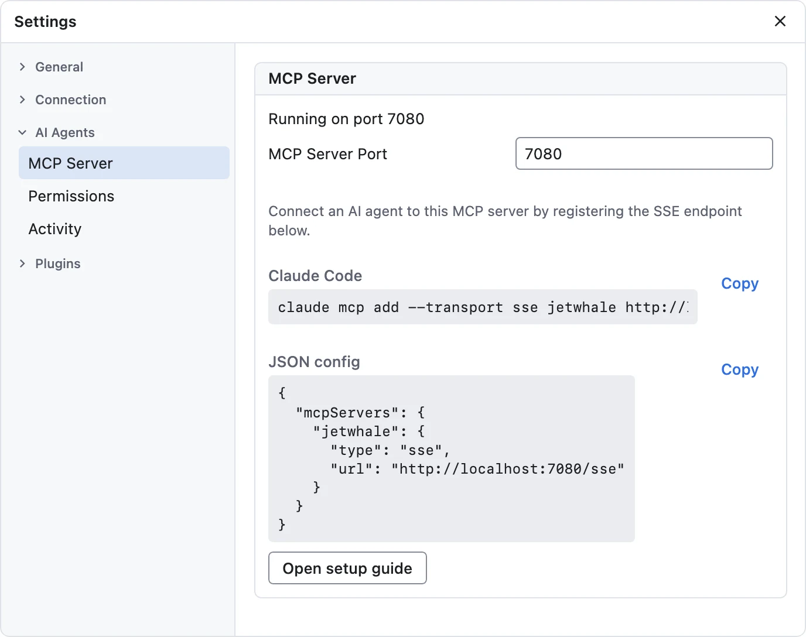
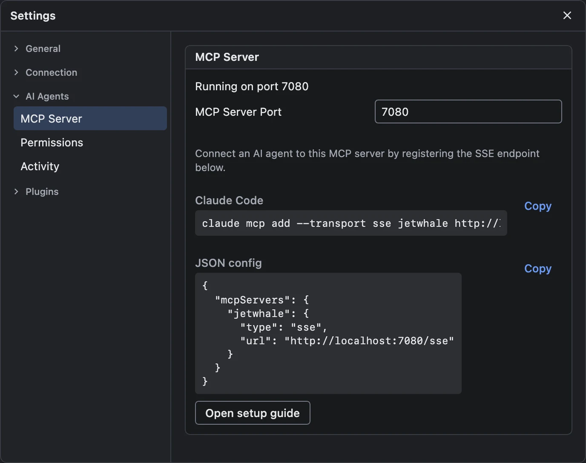
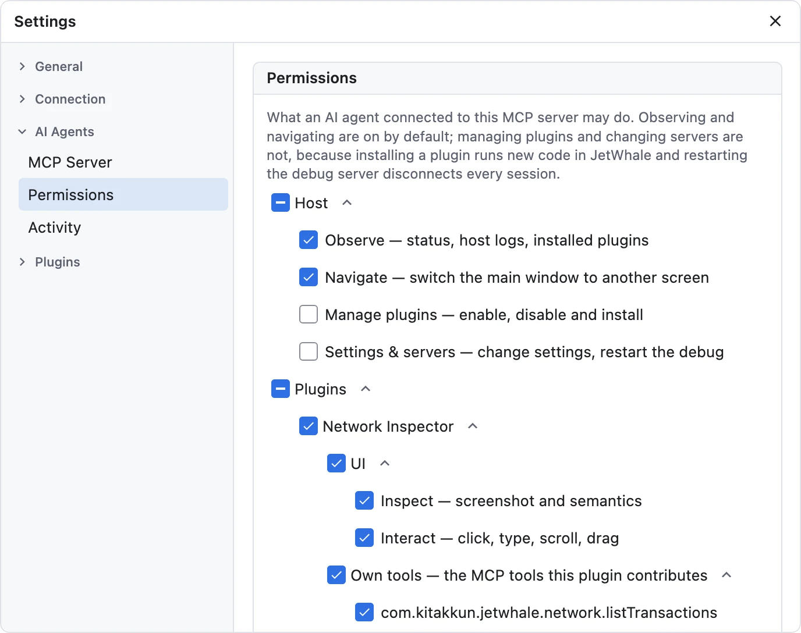
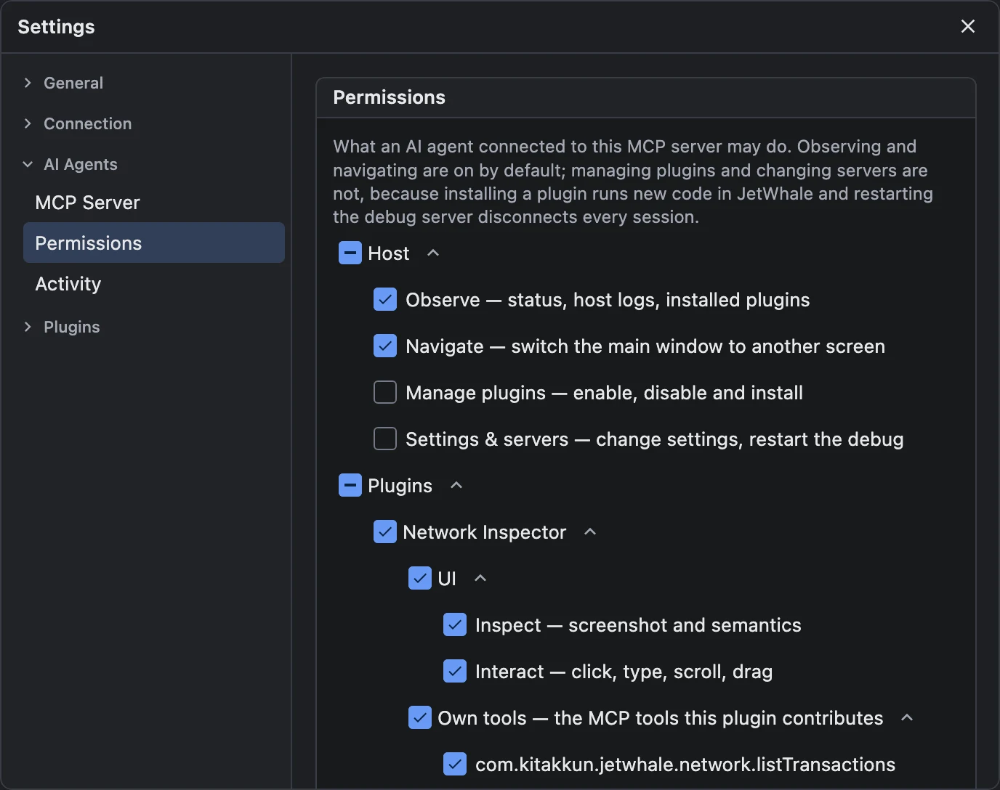
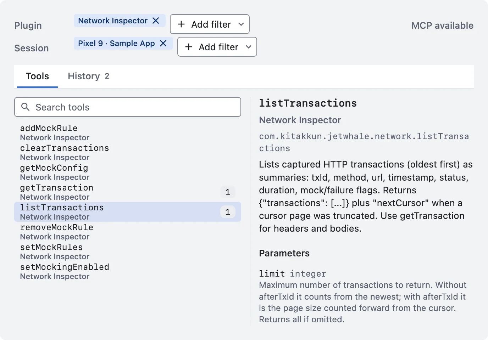
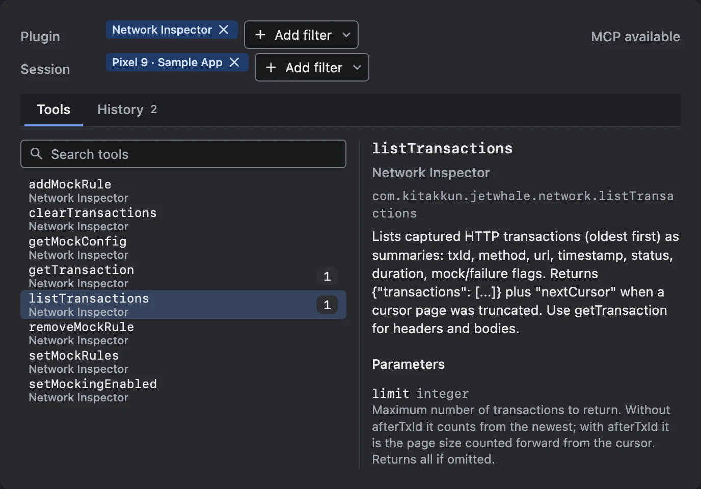

# MCP Server <Badge type="warning" text="experimental" />

The JetWhale host embeds an **MCP (Model Context Protocol) server**, so AI agents such as Claude can
inspect and drive your debugging sessions: use any plugin's UI the way you do, call the tools plugins
contribute, and set the host itself up — read its status and logs, install and enable plugins, change
settings. Tool names and behavior may change between releases.

## Connecting an AI agent

The server speaks MCP over **SSE**, bound to **localhost** on port **7080** by default (configurable
in **Settings → AI Agents → MCP Server**):

- `GET http://localhost:7080/sse` — the SSE stream
- `POST http://localhost:7080/message?sessionId=...` — client-to-server messages

To register it with Claude Code:

```shell
claude mcp add --transport sse jetwhale http://localhost:7080/sse
```

**Settings → AI Agents → MCP Server** shows this command, and a JSON config block for other MCP
clients, already filled in with the port the server is running on.

{.light-only width=688}
{.dark-only width=688}

The tool list is computed **when a client connects** and never changes for that connection, so a
plugin enabled, or a permission allowed again, mid-session shows up only after the client
reconnects.

::: tip Two different things called `sessionId`
The `sessionId` in the `/message` query string is the **MCP transport** session: one per SSE
connection, minted by the MCP library. It has nothing to do with the JetWhale **debug** session ids
that `jetwhale.listSessions` returns and the tools take as arguments.
:::

::: warning The MCP port is unauthenticated
The SSE endpoint has no authentication, so **any process on the machine** can reach it, and it is not
a read-only surface: the host tools change settings and can restart the debug server. Keep that in
mind before exposing the port beyond localhost.
:::

## What an agent can do

| Tools | What they operate on | Reference |
|---|---|---|
| `jetwhale.listSessions`, `jetwhale.listPlugins` | Discovery: the session and plugin ids every other tool takes | [Discovery tools](/reference/mcp-tools#discovery-tools) |
| `jetwhale.screenshot`, `click`, `secondaryClick`, `type`, `scroll`, `drag`, `getAccessibilityTree` | A **plugin's UI inside the host**, the way you use it | [Plugin UI tools](/reference/mcp-tools#plugin-ui-tools) |
| `jetwhale.getStatus`, `getLogs`, `updateSettings`, `navigate`, … | The **host** as a whole | [Host tools](/reference/mcp-tools#host-tools) |
| `com.kitakkun.jetwhale.<plugin>.*` | What each plugin exposes, such as captured traffic or the app's semantics tree | Each plugin's guide |

`jetwhale.getStatus` is the recommended first call: one request with no arguments tells an agent the
host version, both servers' endpoints, how many sessions and plugins are live, the settings, the
permission state, and what the window is showing.

The plugin UI tools read the **host window's** Compose UI. To read the debugged app's own UI, use the
[Compose Semantics Inspector](/guide/compose-semantics-inspector#mcp-tools).

### Plugin-provided tools

Host plugins can add tools of their own. JetWhale injects a required `sessionId` into each, naming
the session the call goes to: a connected app's, or `host` for a plugin that needs no app, such as
the [Device Mirror](/guide/device-mirror#mcp-tools). The official plugins' tools are listed in each
guide, such as the
[Network Inspector's](/guide/network-inspector#mcp-tools). To write one, see
[Developing Plugins → Exposing MCP tools](/guide/developing-plugins#exposing-mcp-tools). A plugin can
hide sensitive values from agents; the Network Inspector's
[redaction rules](/guide/network-inspector#redacting-sensitive-values) do so with an `MCP_ONLY`
scope.

## Permissions

What an agent may do is set in **Settings → AI Agents → Permissions**, a tree of nested checkboxes:

| Group | Tools | Default |
|-------|-------|---------|
| **Observe** | `getStatus`, `getLogs`, `clearLogs`, `listInstalledPlugins` | on |
| **Navigate** | `navigate` | on |
| **Manage plugins** | `setPluginEnabled`, `installOfficialPlugin` | **off** |
| **Settings & servers** | `updateSettings`, `restartDebugServer` | **off** |

Each installed plugin gets a subtree of its own:

| | Covers | Default |
|---|---|---|
| **UI → Inspect** | `screenshot`, `getAccessibilityTree`, for that plugin | on |
| **UI → Interact** | `click`, `secondaryClick`, `type`, `scroll`, `drag`, for that plugin | on |
| **Own tools** | one checkbox per MCP tool the plugin contributes | on |

{.light-only width=688}
{.dark-only width=688}

- **Looking and pressing are separate.** Letting an agent look at a plugin's screen is not the same
  risk as letting it press the buttons on it, so any leaf can be revoked on its own.
- **`secondaryClick` needs Interact, and Inspect for a menu's items.** Its answer lists a popup's
  nodes, which carry what `getAccessibilityTree` would show, so it includes them only when Inspect is
  allowed for that plugin too. With Interact alone it still reports `consumed`, `openedPopup` and
  `closedPopup`, and says in a note why the nodes are left out.
- **The two groups that are off do something unticking cannot undo:** installing a plugin runs new
  code inside JetWhale, and restarting the debug server disconnects every session. A group added by a
  future release starts off rather than inheriting a yes you never gave.
- **A plugin's own tools are listed once the plugin has a live instance**, since that is when it
  publishes them. Denials are kept by tool name, so they survive a disconnect.
- **`jetwhale.listSessions` and `jetwhale.listPlugins` are never gated**: every other tool's
  arguments come from them.
- **A permission applies in two places.** A denied tool is not listed on a new connection, and every
  call is checked as it arrives, so revoking stops an agent that is already connected. Allowing works
  only from the next connection, because a tool list is fixed when the connection opens.

A refused call names the group or plugin that blocked it and the settings screen to change, so an
agent can tell you what to turn on.

### Lifting every permission for one launch

Starting the host with `--mcp-allow-all-permissions` allows everything for that process only:

```shell
./gradlew runJetWhale --args="--mcp-allow-all-permissions"
```

It is for automated QA, where a run that has to enable a plugin or restart a server would otherwise
stop at a checkbox nobody is there to tick. Nothing is written back, so your own choices stay. The
settings screen and `jetwhale.getStatus` both show the lifted state, and the permission tree is
read-only for that launch. Setting it requires starting the host process, already more than the
unauthenticated MCP port grants, so it opens no door that was closed to that caller.

## Installing plugins from an AI agent

`jetwhale.installOfficialPlugin` is deliberately narrow: it accepts only a `pluginId` from the
**official catalog** — no MCP tool installs arbitrary Maven coordinates — and it sits in the **Manage
plugins** group, which is off by default. Installing does not enable, so the sequence is:

1. `jetwhale.installOfficialPlugin`
2. `jetwhale.setPluginEnabled`
3. **Reconnect the MCP client**, since tool lists are computed when a client connects and a newly
   enabled plugin's tools appear only on the next connection.

## The MCP tools browser

The host has its own view of what agents can do and what they have done. Open it from the **wrench
icon** in the [sidebar footer](/guide/host-window#the-sidebar-footer), or from the **MCP badge** on a
plugin's sidebar row, which opens it filtered to that plugin.

{.light-only width=688}
{.dark-only width=688}

**Plugin** and **Session** filters across the top narrow everything below; each is a multi-select,
and with nothing picked it reads *All*. A label at the right says *MCP available*, or *MCP executing*
while a call runs.

- **Tools** — a searchable list of every tool in scope, matching name, description and plugin. The
  selected tool shows its short and fully qualified names, its plugin, its description, and each
  parameter with its type, whether it is **required**, and its description. A badge counts the
  tool's calls and takes a rotating ring while an agent is calling it.
- **History** — the last 100 calls in scope, newest first, with the time and whether each succeeded.
  Selecting one shows the arguments it was called with and the response it returned. Each section
  has a copy button, **Copy details** copies the whole record, and right-clicking a row offers the
  same copy actions.

It is the fastest way to answer "what did the agent actually send, and what did it get back?" when a
plugin behaves unexpectedly under automation.
