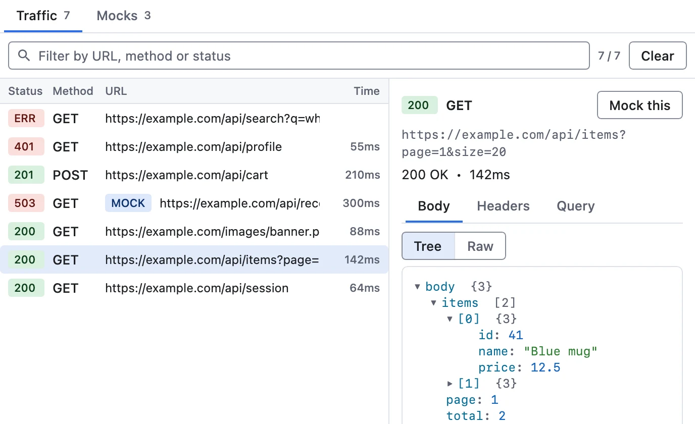
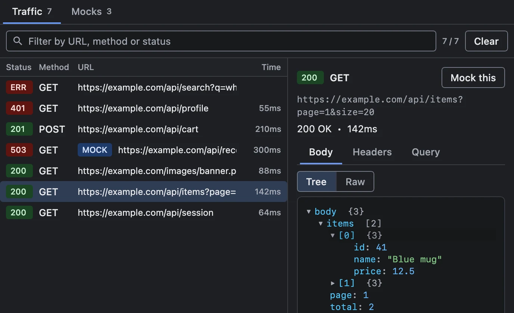
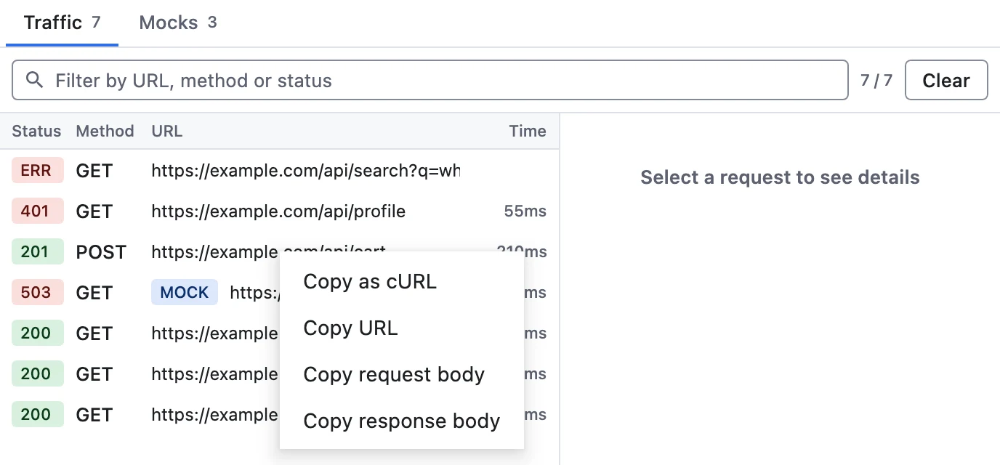
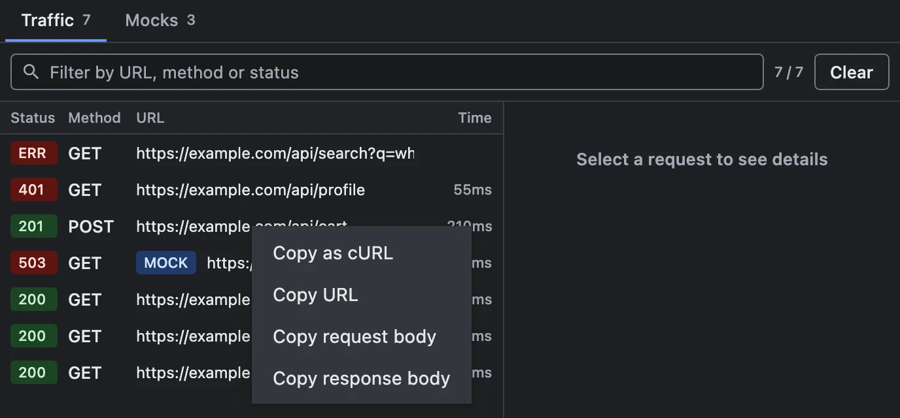
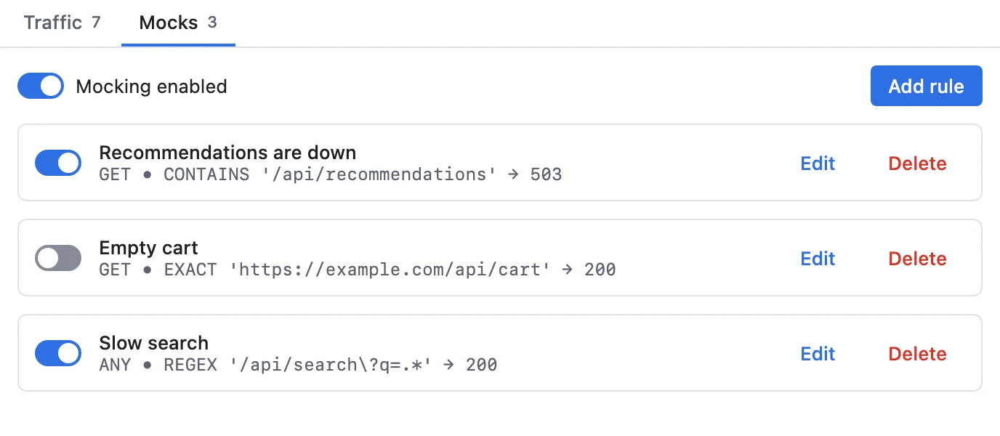
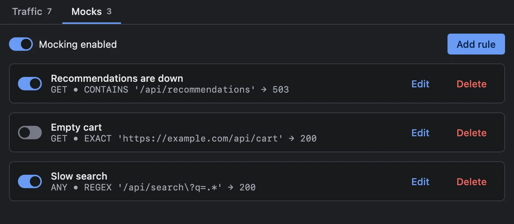

# Network Inspector

The Network Inspector shows the HTTP traffic of your app's **Ktor** and **OkHttp** clients — request
and response headers, bodies and timing — and **mocks responses** from the host without touching
your backend. Redaction rules keep secrets out of what it captures.

**Works with:** every platform through a Ktor client; Android and the JVM through OkHttp.

{.light-only width=688}
{.dark-only width=688}

## Setup

### Install the host plugin

Install **Network Inspector** from **Settings → Plugins → Add Plugins → Official Plugins**. To
install it by Maven coordinates or from a file, see [Host Settings → Plugins](/guide/host-settings#plugins).

### Add the agent to your app

Add the adapter for your HTTP client, next to the agent runtime:

```kotlin
dependencies {
    implementation("com.kitakkun.jetwhale:jetwhale-agent-runtime:<version>")
    // pick the adapter(s) matching your HTTP client:
    implementation("com.kitakkun.jetwhale:jetwhale-network-inspector-agent-ktor:<version>")
    implementation("com.kitakkun.jetwhale:jetwhale-network-inspector-agent-okhttp:<version>")
}
```

Create **one** `JetWhaleNetworkAgentPlugin`, install it into your HTTP client, and register the same
instance in `startJetWhale { }`:

::: code-group

```kotlin [Ktor]
import com.kitakkun.jetwhale.plugins.network.agent.JetWhaleNetworkAgentPlugin
import com.kitakkun.jetwhale.plugins.network.agent.ktor.ktorClientPlugin

val networkAgent = JetWhaleNetworkAgentPlugin()

val client = HttpClient {
    install(networkAgent.ktorClientPlugin())
}

startJetWhale {
    connection { /* ... */ }
    plugins {
        register(networkAgent)
    }
}
```

```kotlin [Ktor, a client you didn't build]
import com.kitakkun.jetwhale.plugins.network.agent.ktor.ktorSendInterceptor
import io.ktor.client.plugins.HttpSend
import io.ktor.client.plugins.plugin

val networkAgent = JetWhaleNetworkAgentPlugin()
val client: HttpClient = /* from your DI container or a library */

client.plugin(HttpSend).intercept(networkAgent.ktorSendInterceptor(client))
// register(networkAgent) in startJetWhale { plugins { } } as well
```

```kotlin [OkHttp]
import com.kitakkun.jetwhale.plugins.network.agent.JetWhaleNetworkAgentPlugin
import com.kitakkun.jetwhale.plugins.network.agent.okhttp.okHttpInterceptor

val networkAgent = JetWhaleNetworkAgentPlugin()

val client = OkHttpClient.Builder()
    .addInterceptor(networkAgent.okHttpInterceptor()) // application interceptor
    .build()

startJetWhale {
    connection { /* ... */ }
    plugins {
        register(networkAgent)
    }
}
```

:::

- **A client you didn't build** — the `HttpSend` interceptor attaches to an already-built client, so
  the construction site stays untouched. Pass the same client it is registered on, which it uses to
  build mocked responses, and register it once: `HttpSend` neither rejects duplicates nor removes an
  interceptor, so registering twice records every transaction twice.
- **OkHttp** — add the interceptor **after** interceptors that finalize the request, such as auth
  interceptors, so the recorded transaction matches what goes on the wire.

### Body capture limits

Both adapters capture request and response bodies up to `100_000` characters, and images as bytes
up to **2 MiB**. A larger image is skipped rather than cut, since half an image cannot be decoded,
and the capture says so. Raise either limit where you need to:

```kotlin
networkAgent.ktorClientPlugin(maxBodyChars = 500_000, maxImageBytes = 8 * 1024 * 1024)
networkAgent.okHttpInterceptor(maxBodyChars = 500_000, maxImageBytes = 8 * 1024 * 1024)
```

### Redacting sensitive values

Captured traffic often holds secrets: `Authorization` headers, session cookies, tokens in query
parameters, passwords in JSON bodies. Pass **redaction rules** to the agent plugin to strip them:

```kotlin
val networkAgent = JetWhaleNetworkAgentPlugin(
    redaction = NetworkRedactionRules {
        header("Authorization", "Cookie")
        header("X-Session-Id", scope = RedactionScope.MCP_ONLY)
        urlQueryParam("token", strategy = RedactionStrategy.MASK)
        bodyField("password", "access_token")
    },
)
```

`header(...)`, `urlQueryParam(...)` and `bodyField(...)` match names case-insensitively; `bodyField`
matches a field anywhere in a JSON body, or a parameter of an `application/x-www-form-urlencoded`
body. Each rule takes two options:

- **`scope`** — `EVERYWHERE` (default) redacts at capture time on the agent, so the value never
  leaves the app. `MCP_ONLY` keeps it visible in the host but hides it from AI agents connected over
  the [MCP server](/guide/mcp-server).
- **`strategy`** — `PLACEHOLDER` (default) shows a `<redacted>` marker; `MASK` shows one `*` per
  character, keeping the value's length.

Without a `redaction` argument, captured data is forwarded verbatim.

## Using it

### Traffic

Select your app in the sidebar and open **Network Inspector**: each HTTP transaction appears in the
**Traffic** tab as the app makes it. The detail pane shows headers, bodies (JSON in a dedicated
view) and status, all text-selectable. Right-click a
transaction for **Copy as cURL**, **Copy URL** and its request and response bodies.

{.light-only width=688}
{.dark-only width=688}

An image body (`image/*`, except SVG, which stays text) shows as a picture with its dimensions and
size. **Copy image** puts it on the clipboard, and **Save image…** writes the exact bytes the server
sent. **Mock this** on an image response keeps those bytes, so the mock serves the same image.

Use **Clear** before reproducing an issue, so what you capture afterwards is only what the
reproduction produced.

### Mocks

The **Mocks** tab defines mock rules and pushes them to the running app: while **Mocking enabled** is
on, a request matching a rule gets the mocked response instead of reaching the network. It is handy
for error states, empty lists or slow payloads without a test backend, and needs no app restart.

{.light-only width=688}
{.dark-only width=688}

**Add rule** opens an editor with these fields. The [MCP tools](#mcp-tools) take the same shape, so a
rule written by hand and one written by an agent are interchangeable.

| Field | Default | Meaning |
|-------|---------|---------|
| **Name** | empty | Label shown in the list. |
| **enabled** | on | Whether the rule takes effect, so a rule can be parked without deleting it. |
| **Method** | any | HTTP method to match, case-insensitively. Blank matches any method. |
| **URL pattern** | — | The pattern, read according to the match type. |
| **match type** | `CONTAINS` | `CONTAINS` (substring), `EXACT` (whole URL), or `REGEX` (must match somewhere in the URL). An invalid regex never matches. |
| **Status** | `200` | Status code of the mocked response. |
| **Content-Type** | none | Shortcut for the header of the same name. |
| **Response body** | empty | The body to return. |
| **Delay ms** | `0` | Delay before the mocked response is delivered. |

The **first enabled rule that matches** wins, so order the list from most specific to most general.
Every adapter matches the same way.

::: tip The app owns the mock config
The rules and the enabled flag live in the **agent**, not the host: they survive a host restart, the
host reads them back when it reconnects, and a new rule applies without restarting the app.
:::

## MCP tools

With the [MCP server](/guide/mcp-server) running, an AI agent can read captured traffic and manage
mock rules through these tools. Each takes the `sessionId` of the app's session.

| Tool | What it does |
|------|--------------|
| `com.kitakkun.jetwhale.network.listTransactions` | Lists captured HTTP transactions, filterable |
| `com.kitakkun.jetwhale.network.getTransaction` | Returns one transaction in full (headers, bodies, timing) — takes `txId` from `listTransactions` |
| `com.kitakkun.jetwhale.network.clearTransactions` | Clears the captured transaction list |
| `com.kitakkun.jetwhale.network.getMockConfig` | Returns the current mock rules and whether mocking is enabled |
| `com.kitakkun.jetwhale.network.addMockRule` | Adds one mock rule from flat arguments |
| `com.kitakkun.jetwhale.network.removeMockRule` | Removes the rule with a given `id` |
| `com.kitakkun.jetwhale.network.setMockRules` | Replaces the **whole** rule list in one call |
| `com.kitakkun.jetwhale.network.setMockingEnabled` | Turns mocking on or off |

- `listTransactions` narrows a busy capture with `limit`, `afterTxId` (everything recorded after a
  transaction you already have: the cheap way to poll), `sinceTimestampMs` / `untilTimestampMs`,
  `urlContains` and `method`.
- `addMockRule` takes the rule's fields flat (`urlPattern`, `matchType`, `method`, `name`,
  `statusCode`, `body`, `headers`, `contentType`, `delayMs`), appends one enabled rule with a
  generated id, and returns it. `contentType` only fills in a `Content-Type` header when `headers`
  did not set one. `setMockRules` instead takes a JSON list of complete rules and **replaces** the
  set: the tool for setting up a scenario, editing a rule (reuse its `id`), or parking one
  (`enabled: false`).
- An image body is summarized (media type and size) rather than inlined as Base64.
- Values redacted with `RedactionScope.MCP_ONLY` are hidden from these results **and** from
  `jetwhale.screenshot` and `jetwhale.getAccessibilityTree` captures of the plugin. Until the host has
  read the app's rules, normally right after the app connects, `listTransactions` and
  `getTransaction` return an error and captures show a notice instead of the traffic.

## Limits

- The host keeps the **latest 500 transactions** per session; older ones are dropped as traffic
  arrives.
- While the host is away, the agent buffers up to **256** events, dropping the oldest past that, and
  sends them on reconnect, so requests made before you opened the host still show up.
- Only Ktor and OkHttp clients are captured.
