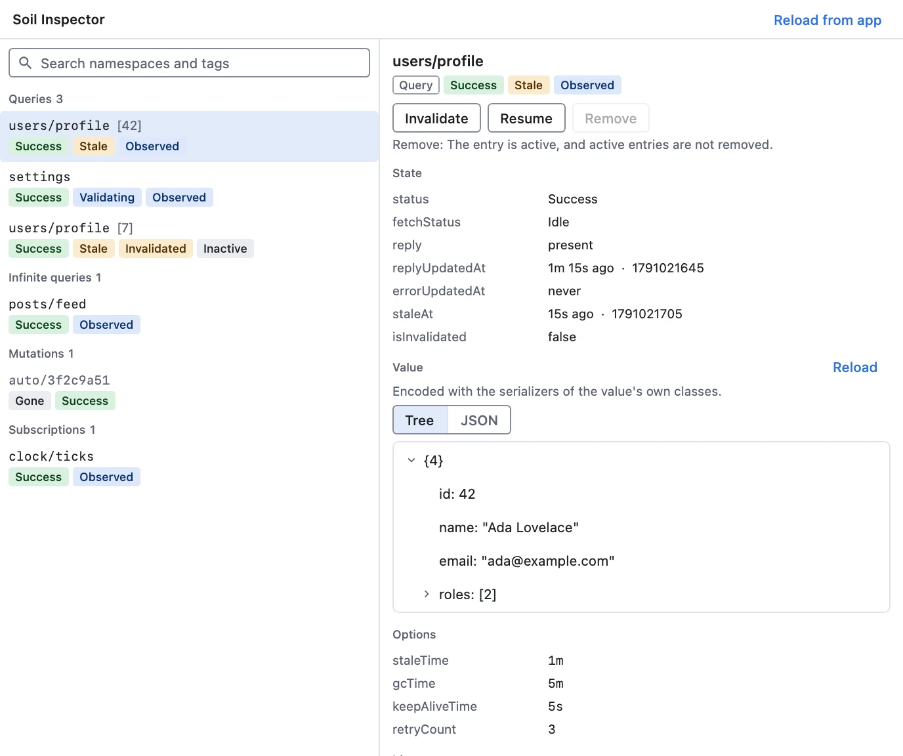
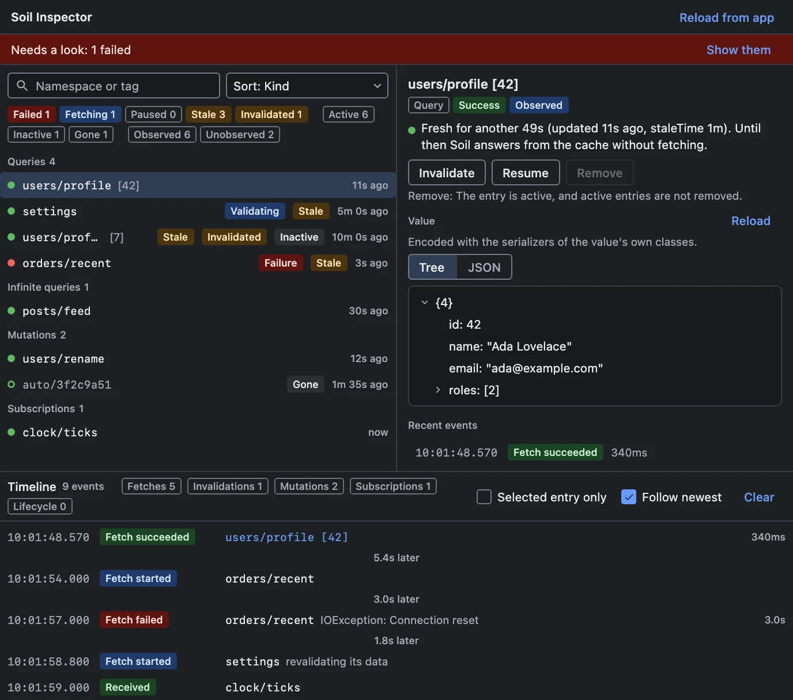
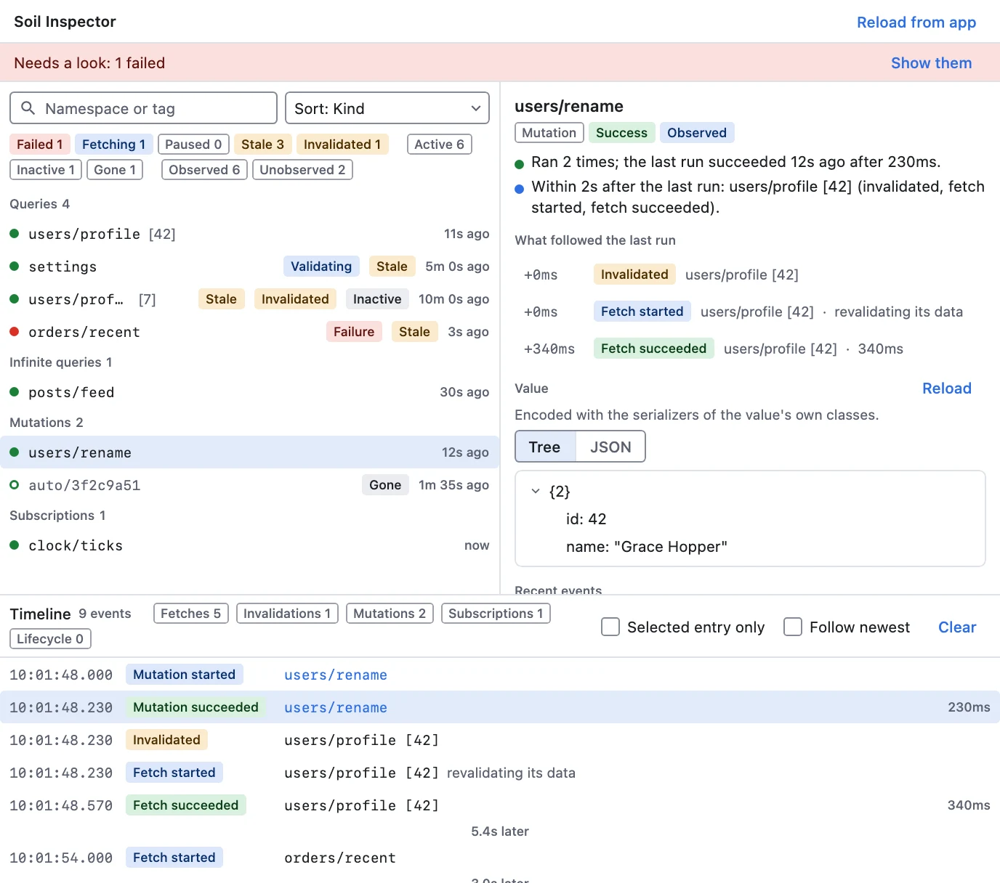
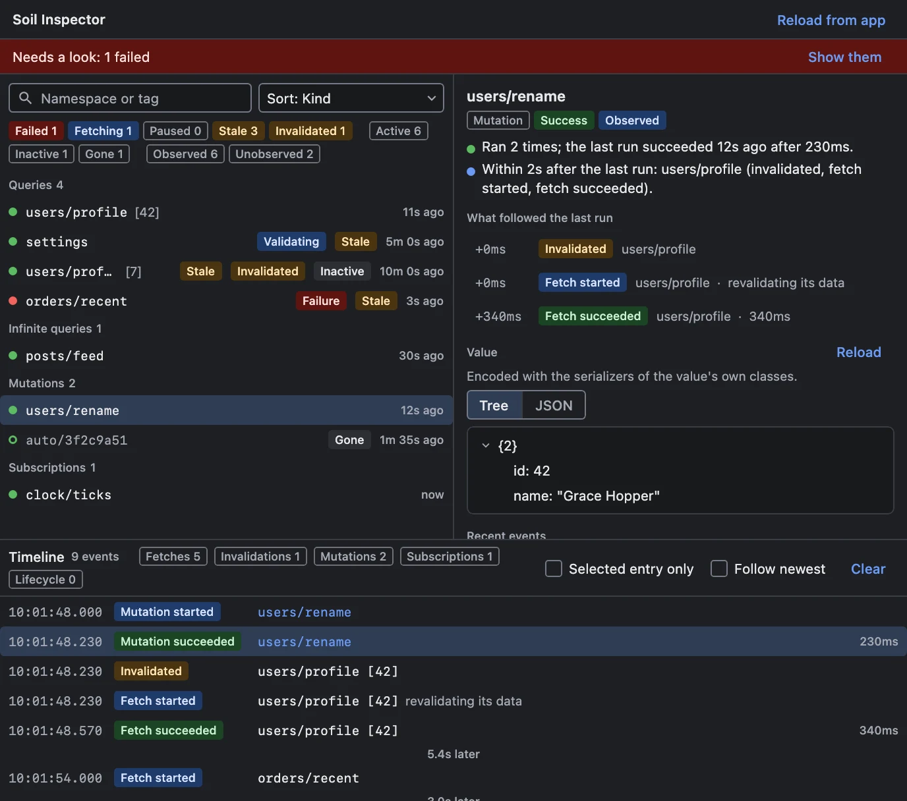

# Soil Inspector

The Soil Inspector shows what the [Soil](https://github.com/soil-kt/soil) cache of the app you are
debugging holds — its queries, infinite queries, mutations and subscriptions — and what happens to
it as you use the app. It explains in words why an entry is stale or not refetching, calls out
failures, and shows what a tap or a mutation set off. From the host or from an AI agent over MCP,
you can invalidate a query, resume a query or subscription, or remove an inactive entry from the
cache.

**Works with:** Android, iOS, desktop (JVM) and the web, the platforms Soil supports.

{.light-only width=688}
{.dark-only width=688}

::: warning Built against one Soil version
Soil has no public API for listing its cache, so the agent reads it through Soil's internal API.
That API can change in any Soil release, so the agent is built and tested against one Soil version,
currently **1.0.0-alpha15**. Use the same version in your app.
:::

## Setup

### Install the host plugin

Install **Soil Inspector** from **Settings → Plugins → Add Plugins → Official Plugins**. To install
it by Maven coordinates or from a file, see [Host Settings → Plugins](/guide/host-settings#plugins).

### Add the agent to your app

```kotlin
dependencies {
    implementation("com.kitakkun.jetwhale:jetwhale-agent-runtime:<version>")
    implementation("com.kitakkun.jetwhale:jetwhale-soil-inspector-agent:<version>")
}
```

Hand the plugin the client your app gives `SwrClientProvider`, and the policy you built it with:

```kotlin
val policy = SwrCachePolicy(coroutineScope = SwrCacheScope())
val swrClient = SwrCache(policy)

startJetWhale {
    connection { /* ... */ }
    plugins {
        register(JetWhaleSoilAgentPlugin(swrClient, policy))
    }
}
```

`SwrCachePlus` with a `SwrCachePlusPolicy` works the same way and adds the subscriptions.

| You pass | The inspector shows |
|----------|---------------------|
| The client and its policy | Every entry: those in use, and those Soil keeps cached after their screen left, until their `gcTime` runs out |
| The client, and `null` for the policy | Active entries only, read on `Dispatchers.Main` |
| A client that wraps Soil's own | Nothing: it says the client is unsupported, since only `SwrCache` and `SwrCachePlus` can be read |

### Values

The agent encodes an entry's value with the serializer of the value's own class, walking into
lists, sets, arrays, maps, pairs and infinite-query chunks. That covers any `@Serializable` class,
generic ones such as `Page<User>` included, and the built-in types. A value holding a class with no
serializer is shown with `toString()`. To show it as JSON, or to show any value in a shape of your
own, register a serializer by namespace or by id class:

```kotlin
JetWhaleSoilAgentPlugin(
    client = swrClient,
    policy = policy,
    valueSerializers = SoilValueSerializers {
        namespace("users/avatar", AvatarSerializer)
        idClass<GetReceiptKey.Id>(ReceiptSerializer)
    },
)
```

A registered serializer describes the value one fetch returns, so for an infinite query it is the
serializer of one chunk's data. The detail pane says which way each value was encoded.

## Using it

The entries are on the left, what the selected one's state means on the right, and the timeline of
what happened below. Each answers a question you would otherwise answer with log statements:

- **Why does this screen show old data?** Search for the key, or sort by **Recent activity**. The
  detail pane says whether the data is fresh, and for how long, or stale: when it was last updated,
  its `staleTime`, whether it is invalidated and whether a screen observes it. Soil refetches stale
  data only when something asks — a screen starting to observe it, an invalidation, a resume, or
  focus and reconnect events where the app reports them — never on a timer, and the pane says so.
- **What did my tap trigger?** Watch the timeline as you tap. Fetches, invalidations, mutations and
  subscription values appear in order, with how long each fetch or run took, and a gap line marks
  where one burst ends and the next begins. Repeats in a row, such as a subscription's values, share
  one line with a count. Click an event to select its entry; **Follow newest** keeps the latest in
  view.
- **Something failed.** Failures, queries paused after an error and fetches running over ten seconds
  are called out above the list, and **Show them** narrows the list to the failed, paused and
  running entries. The detail pane gives
  the error, how often the entry failed in the timeline, and whether Soil still holds back fetches.
  Soil retries within a fetch, and only for the errors the query's `shouldRetry` accepts, so the
  inspector shows the outcome rather than each attempt.
- **Does my mutation invalidate the right queries?** Select the mutation: the detail pane lists what
  other entries did within two seconds after its last run, such as the queries it invalidated and
  their refetches.

{.light-only width=688}
{.dark-only width=688}

- **What is cached, and when does it go away?** Filter by **Inactive**. A cached entry says how long
  it has been unused and when Soil drops it, from its `gcTime`.
- **How far did my infinite query page?** Its detail pane counts the pages loaded and lists the
  param each was fetched with.

The chips above the list filter by condition and show how many entries meet each. Conditions in
one group add up (**Failed** or **Stale**), groups narrow each other (**Failed** and
**Inactive**). The search, the chips and the sort are kept when you reopen the inspector; **Clear
filters** brings every entry back. Up and down move the selection in the list and in the timeline.

Below the explanation, the detail pane has **Invalidate**, **Resume** and **Remove**, each disabled
with the reason where it does not apply, then the entry's value as a JSON tree or text, its latest
events, its state field by field under Soil's own names, and its options. A mutation Soil drops
once its screen leaves stays listed with its last state, marked **Gone**.

::: info The timeline is read, not recorded
Soil does not report what happens to its cache, so the agent compares one reading of it with the
next and records the difference. Soil's state flows keep only the latest state, so a fetch that
starts and ends between two readings shows up as **Data updated** without a duration, and a state
shorter than a reading can be missed altogether. A new entry is noticed within half a second, so
a fetch it was already running when it was noticed gets no duration, and the detail pane says how
long it has run *at least*.
:::

## MCP tools

With the [MCP server](/guide/mcp-server) running, an AI agent can do the same through these tools.
Each takes the `sessionId` of the app's session; entries are named by the `handle` that
`listEntries` reports.

| Tool | What it does |
|------|--------------|
| `com.kitakkun.jetwhale.soil.listEntries` | The entries with their state, options and the conditions they meet, and the problems the list calls out; narrows by `search` and `conditions` and orders by `sort` as the list does, and by `kind` or `status` |
| `com.kitakkun.jetwhale.soil.listEvents` | The timeline, oldest first; pass the `lastSequence` of one call as `since` to the next to read only what happened in between, and narrow by `handle`, `search` or `categories` |
| `com.kitakkun.jetwhale.soil.getEntry` | One entry with its value, the explanation the detail pane gives, its latest events, what followed a mutation's last run, and which actions apply |
| `com.kitakkun.jetwhale.soil.invalidateEntry` | Invalidates a query or infinite query, active or inactive |
| `com.kitakkun.jetwhale.soil.resumeEntry` | Resumes a query or subscription a screen observes |
| `com.kitakkun.jetwhale.soil.removeInactiveEntry` | Removes an inactive query or subscription from the cache |

## Limits

- **It never removes an active entry.** Removing one while a screen holds it would leave that screen
  with nothing to observe, so only cached, inactive entries can be removed, and the agent checks
  again just before removing one.
- **It never writes data.** There is no way to set an entry's value, or to purge or garbage-collect
  the whole cache.
- **Resume reaches observed entries only.** Soil hands a resume to the screens that observe an entry,
  so an entry nothing observes ignores it.
- **A value is cut at 256 K characters.** The detail pane says when one was.
- **The timeline keeps the latest 1,000 events.** The app keeps its latest 500 for a host that
  connects later; **Clear** empties the host's.
- **Additions and removals take up to half a second to show.** Soil announces neither, so the agent
  reads its stores twice a second. A change to an active entry's state shows within a moment.
