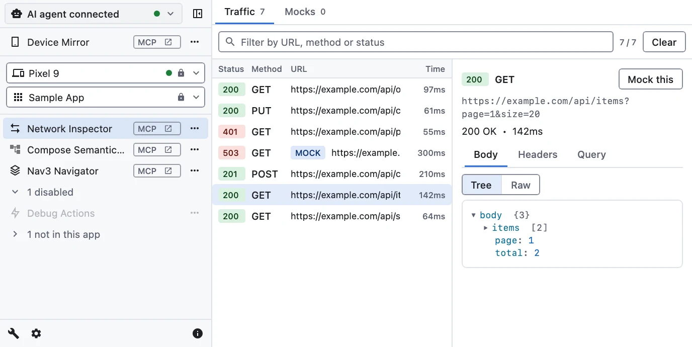
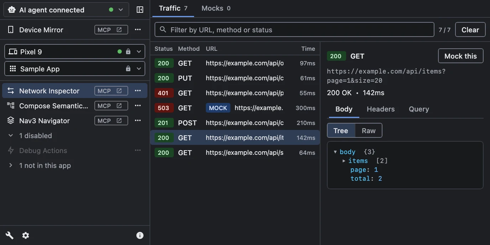

# What is JetWhale?

JetWhale is an extensible debugging tool inspired by
[Flipper](https://github.com/facebook/flipper), built with Kotlin and Jetpack Compose for Kotlin
Multiplatform apps: Android, desktop (JVM), iOS and the web.

{.light-only width=688}
{.dark-only width=688}

::: warning Active development
This project is under active development. We welcome feedback as we work toward a stable release.
Please note that the Plugin SDK APIs are not yet finalized and may change in the future.
:::

## How it works

- **The host** is a desktop application, the debugger UI, that you run on your development machine.
- **The agent** is a small runtime you add to the app being debugged. It connects to the host over a
  WebSocket and exchanges type-safe messages powered by kotlinx.serialization.
- **Plugins** are the debugging tools. Each is a JAR the host loads at runtime, usually paired with an
  agent plugin in the app; a few, like the Device Mirror, run in the host alone.

One host debugs **several sessions at once** — an Android device and a desktop app, say — each
labeled with the app's name and icon and grouped by the device it runs on; see
[Session metadata](/guide/agent-configuration#session-metadata). Apps on the host machine connect
over plain ws on loopback, and physical devices over **wss**; see
[Connecting Devices](/guide/connecting).

## Official plugins

| Plugin | What it is for | Needs an agent in the app |
|---|---|---|
| [Network Inspector](/guide/network-inspector) | HTTP traffic of Ktor and OkHttp clients, with response mocking | Yes |
| [Compose Semantics Inspector](/guide/compose-semantics-inspector) | The semantics tree of a running screen, and driving it by node | Yes |
| [Nav3 Navigator](/guide/nav3-navigator) | The Navigation 3 back stack, and pushing or popping entries | Yes |
| [Debug Actions](/guide/debug-actions) *(experimental)* | The app's debug menu as typed actions | Yes |
| [Storage Inspector](/guide/storage-inspector) | The app's files, caches and key-value stores | Yes |
| [Soil Inspector](/guide/soil-inspector) | The app's Soil queries, mutations and subscriptions, with their state and values | Yes |
| [Device Mirror](/guide/device-mirror) *(experimental)* | Live screens of Android devices, iOS simulators and iPhones | No |

The host also embeds an [MCP server](/guide/mcp-server) *(experimental)*, so an AI agent can use the
same plugins.

## Next steps

- [Getting Started](/guide/getting-started) — install the host and integrate the agent into your app
- [The Host Window](/guide/host-window) — sessions, the sidebar, and popping a plugin out
- [ADB auto port mapping](/guide/adb-auto-port-mapping) — zero-setup Android debugging
- [MCP Server](/guide/mcp-server) *(experimental)* — let an AI agent drive the app
- [Developing Plugins](/guide/developing-plugins) — build your own debugging tools
